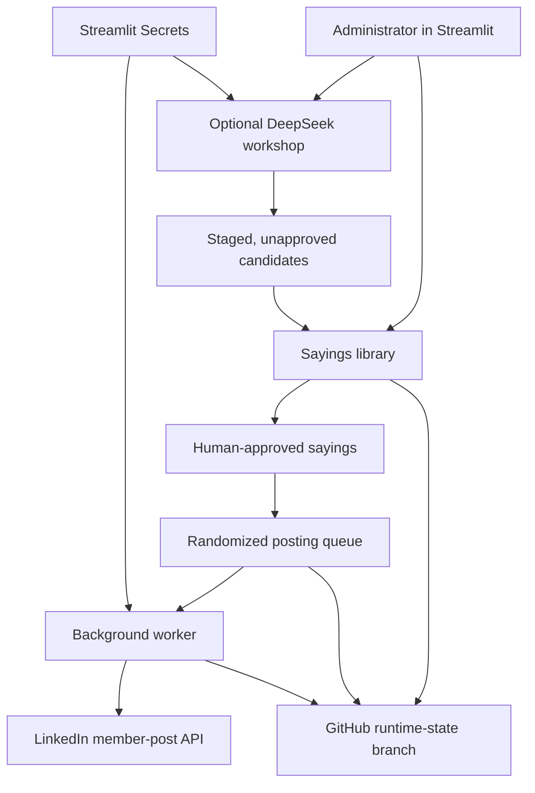

<div align="center">

# li_poster

### Human-reviewed, Latin-first LinkedIn publishing

Prepare, verify, schedule, and publish short secular sayings through a
Streamlit application without treating AI generation as source verification.

[](https://www.python.org/)
[](https://streamlit.io/)
[](https://learn.microsoft.com/linkedin/)
[](https://api-docs.deepseek.com/)
[](#known-limitations)
[](https://github.com/peristron/LI_poster/issues)
[](https://github.com/peristron/LI_poster/pulls)

[Overview](#overview) · [Capabilities](#capabilities) ·
[Deployment](#deployment-and-integration) · [Using the app](#recommended-workflow) ·
[AI safeguards](#deepseek-ai-and-source-verification) ·
[Troubleshooting](#troubleshooting)

</div>

---

## Overview

`li_poster` is a self-contained Streamlit application that prepares, reviews,
schedules, and publishes short Latin-first posts to a connected LinkedIn member
profile.

Each published post uses this structure:

```text
Latin text

English translation

— attribution
```

The application combines a curated library, optional DeepSeek editorial
assistance, human approval, randomized scheduling, LinkedIn OAuth 2.0, and
GitHub-backed state. It is designed for cautious personal automation rather
than unattended high-volume posting.

> [!IMPORTANT]
> An AI-generated attribution, source language, period, translation, or
> confidence label is a review lead, not proof. Only approve a saying after
> checking its wording and source against a reliable edition or scholarly
> reference.

### Feedback is welcome

The easiest way to ask a question, report a defect, or suggest an improvement
is to [open a GitHub Issue](https://github.com/peristron/LI_poster/issues/new).
Focused code or documentation changes can be submitted through a
[pull request](https://github.com/peristron/LI_poster/pulls).

## Why li_poster?

Small personal posting automations still need durable state, authentication,
duplicate protection, editorial review, and safe failure behavior. This
application brings those concerns into one inspectable interface.

It is especially useful when you want to:

1. maintain a reviewed library of short Latin-first posts;
2. translate secular sayings from Latin or another source language;
3. explore pre-modern material from Latin, Greek, Chinese, Arabic, and other
   traditions;
4. randomize post dates and times inside controlled limits;
5. preview a queue before anything is published;
6. keep credentials in Streamlit Secrets rather than source code; and
7. retain a human approval boundary around probabilistic AI output.

## Capabilities

### Application areas

| Area | Current capability | Important boundary |
|---|---|---|
| Sayings library | Review, edit, approve, import, and export sayings | Only approved entries can be scheduled |
| DeepSeek workshop | Suggest, translate, review, and backfill metadata | AI output is never automatically approved or published |
| Source-language controls | Prefer, balance, or require a source language | The label is model-produced until independently verified |
| Secular-content policy | Screens publishable fields for excluded religious or theological language | The filter is conservative and cannot replace editorial judgment |
| Scheduling | Randomizes eligible weekdays and times within configured limits | Timing is approximate on Streamlit Community Cloud |
| LinkedIn connection | OAuth 2.0 connection to a LinkedIn member profile | The associated LinkedIn Page is not the posting destination |
| Publishing safety | Dry-run, pause, queue inspection, claims, and uncertain-result handling | A connections-only test is a real immediate post |
| Persistence | Stores operational state on a separate GitHub branch | Repository visibility affects non-secret state visibility |
| Token protection | Encrypts the LinkedIn access token with Fernet before persistence | Losing or rotating the key requires reconnection |
| Activity history | Records connection, library, queue, and publishing events | Logs may contain operational metadata |

### Content metadata

Each library or staged-candidate record can include:

- Latin wording and English translation;
- attribution and original source text;
- Latin classification;
- primary theme;
- source language and period;
- source confidence and verification status;
- AI review status, duplicate warning, and policy warning; and
- an internal editorial note.

Internal review metadata is not included in the LinkedIn post.

## How it works



The deployed Streamlit process starts a background worker. Approximately every
45 seconds, while the process is awake, the worker:

1. loads the latest state from GitHub;
2. confirms that automation is enabled and dry-run is off;
3. confirms that LinkedIn is connected and the token has not expired;
4. finds and claims the next due queued item;
5. confirms that the underlying saying remains approved;
6. publishes the post through LinkedIn;
7. records the result; and
8. replenishes the randomized schedule when appropriate.

> [!CAUTION]
> Streamlit Community Cloud is not a guaranteed always-on scheduler. An
> external app-waker can reduce hibernation, but posting times remain
> best-effort and may be delayed by restarts or platform availability.

## Recommended workflow

1. Keep **Automation: Paused** and **Dry-run mode** on.
2. Connect the LinkedIn member account.
3. Review bundled, imported, translated, or AI-generated sayings.
4. Independently verify the Latin, translation, attribution, source language,
   and period.
5. Add acceptable AI candidates to the library as unapproved entries.
6. Approve and save only verified library entries.
7. Configure schedule limits and fill a randomized dry-run queue.
8. Inspect every queued post.
9. Optionally publish one explicit connections-only test.
10. Turn dry-run off and enable automation only after the full workflow has
    been validated.

## Quick reference

| Item | Current value |
|---|---|
| Main application file | `streamlit_app.py` |
| Supported Python version | Python 3.12 |
| Streamlit URL used during setup | `https://liposter.streamlit.app/` |
| Runtime-state branch | `runtime-state` |
| Runtime-state file | `runtime/state.json` |
| LinkedIn authorization scopes | `openid profile w_member_social` |
| Default DeepSeek model | `deepseek-v4-flash` |
| Background worker interval | Approximately 45 seconds while awake |
| Default timezone | `America/Toronto` |
| Recommended initial mode | Automation paused and dry-run on |

## Repository structure

The minimal deployment contains:

```text
LI_poster/
├── README.md          # Setup, operation, security, and troubleshooting
├── requirements.txt   # Python dependencies
└── streamlit_app.py   # Complete monolithic Streamlit application
```

The application creates and maintains runtime state through the GitHub API.
No database or generated state file needs to be committed to the main branch.

## Quick local validation

Local execution is optional, but it is useful before replacing the deployed
file.

### Requirements

- Python 3.12
- `pip`
- the packages listed in `requirements.txt`

### 1. Create a virtual environment

<details>
<summary><strong>Windows PowerShell</strong></summary>

```powershell
python -m venv .venv
.\.venv\Scripts\Activate.ps1
```

</details>

<details>
<summary><strong>macOS or Linux</strong></summary>

```bash
python3 -m venv .venv
source .venv/bin/activate
```

</details>

### 2. Install and compile

```bash
python -m pip install --upgrade pip
pip install -r requirements.txt
python -m py_compile streamlit_app.py
```

### 3. Run the application

```bash
streamlit run streamlit_app.py
```

Local OAuth testing requires a redirect URI registered in the LinkedIn
developer application. Do not replace the working production redirect URI
unless you intentionally configure and test an additional local callback.

> [!WARNING]
> Never commit `.streamlit/secrets.toml`, copied Streamlit Secrets, access
> tokens, client secrets, passwords, or the Fernet key.

## Deployment and integration

### Prerequisites

Before deployment, prepare:

- a GitHub account and repository;
- a Streamlit Community Cloud account connected to GitHub;
- a LinkedIn member account;
- a LinkedIn Page that you own or are authorized to use for developer-app
  association;
- a LinkedIn developer application;
- the LinkedIn **Share on LinkedIn** product;
- the LinkedIn **Sign In with LinkedIn using OpenID Connect** product;
- a fine-grained GitHub personal access token;
- an application administrator password;
- a Fernet encryption key; and
- optionally, a DeepSeek API key.

## 1. Create the GitHub repository

1. Create a repository, such as `LI_poster`.
2. Upload the application as `streamlit_app.py`.
3. Upload `requirements.txt`.
4. Add this `README.md`.
5. Keep credentials out of every branch and committed file.

### Repository privacy

The application writes runtime information to a `runtime-state` branch. That
state includes:

- sayings and AI candidates;
- schedule settings and queued posts;
- posting history and application events;
- the LinkedIn display name;
- temporary OAuth state; and
- the LinkedIn access token encrypted with the Fernet key.

If the repository is public, the runtime-state branch and its non-secret
metadata are also public. The LinkedIn token remains encrypted, but a private
repository is preferable when the connected Streamlit plan supports it.

## 2. Create the GitHub state token

Create a fine-grained GitHub personal access token:

1. Open GitHub **Settings**.
2. Open **Developer settings**.
3. Open **Personal access tokens**.
4. Select **Fine-grained tokens**.
5. Select **Generate new token**.
6. Give it a descriptive name, such as `li_poster Streamlit state`.
7. Select an appropriate expiration date.
8. Set the resource owner to your GitHub account.
9. Select **Only select repositories**.
10. Select only the `LI_poster` repository.
11. Under repository permissions, set **Contents** to **Read and write**.
12. Leave the required **Metadata** permission as **Read-only**.
13. Generate the token.
14. Copy it immediately and store it securely.

This token becomes `GITHUB_STATE_TOKEN` in Streamlit Secrets.

The application uses the token to:

- inspect the repository's default branch;
- create `runtime-state` if it does not exist;
- create `runtime/state.json`; and
- read and update the runtime state.

## 3. Create the LinkedIn Page

LinkedIn requires a Page association when creating a developer application.
This Page is not necessarily the destination for posts.

For this application:

- the developer application is associated with a Page;
- OAuth connects an individual LinkedIn member; and
- posts are published to that connected member's profile.

Do not associate an employer's Page unless you are authorized to do so.

If LinkedIn offers a default Page for individual developers, it can be used.
Alternatively, create a small Page that accurately represents the personal
project:

1. Open LinkedIn's Page-creation workflow.
2. Enter a project name, such as `li_poster`.
3. Choose a unique Page URL.
4. Add a valid website URL if required.
5. Choose an accurate industry.
6. Use the smallest accurate organization size.
7. Choose an accurate organization type, such as **Self-employed**, when
   appropriate.
8. Add a logo and short description.
9. Confirm that you are authorized to create and manage the Page.
10. Create the Page.

If a newly created Page is not immediately visible in the developer-app form,
wait briefly, reload the form, search by Page name, and try the complete Page
URL. If LinkedIn removes or makes the Page unavailable, recreate or restore it
before continuing.

## 4. Create the LinkedIn developer application

1. Open the LinkedIn Developer portal.
2. Open **My apps**.
3. Select **Create app**.
4. Enter the application name, such as `li_poster`.
5. Select the project Page created or authorized in the previous step.
6. Provide a stable, publicly accessible privacy-policy URL.
7. Upload a square application logo.
8. Read and accept the LinkedIn API terms.
9. Select **Create app**.

The selected LinkedIn Page cannot normally be changed after the application is
created. Confirm the Page before saving.

## 5. Add the LinkedIn products

Open the developer application's **Products** tab.

Request and confirm access to:

1. **Share on LinkedIn**
2. **Sign In with LinkedIn using OpenID Connect**

The **Share on LinkedIn** product supplies member-posting access. OpenID Connect
supplies member identity and sign-in scopes.

The application requests:

```text
openid profile w_member_social
```

Additional advertising, community-management, organization, events, lead-sync,
or portability APIs are not required for the current member-posting workflow.

## 6. Configure LinkedIn OAuth

Open the developer application's **Auth** tab.

### Copy the credentials

Copy:

- **Client ID**
- **Primary Client Secret**

These become:

```toml
LINKEDIN_CLIENT_ID = "..."
LINKEDIN_CLIENT_SECRET = "..."
```

Never put the client secret in GitHub.

### Add the redirect URI

Under **Authorized redirect URLs for your app**, add the exact deployed
Streamlit URL:

```text
https://liposter.streamlit.app/
```

The value must exactly match `LINKEDIN_REDIRECT_URI` in Streamlit Secrets.
Scheme, hostname, path, and trailing slash must match.

For example, these may be treated as different:

```text
https://liposter.streamlit.app
https://liposter.streamlit.app/
```

Use the exact form configured in both locations.

## 7. Generate the application secrets

### Administrator password

Use a long, unique password. To generate a random value in Windows PowerShell:

```powershell
$b = New-Object byte[] 32; $rng = [System.Security.Cryptography.RandomNumberGenerator]::Create(); $rng.GetBytes($b); $rng.Dispose(); [Convert]::ToBase64String($b)
```

### Fernet key

The Fernet key must be a URL-safe Base64 encoding of exactly 32 random bytes.
In Windows PowerShell:

```powershell
$b = New-Object byte[] 32; $rng = [System.Security.Cryptography.RandomNumberGenerator]::Create(); $rng.GetBytes($b); $rng.Dispose(); ([Convert]::ToBase64String($b)).Replace('+','-').Replace('/','_')
```

Or, in a Python environment containing `cryptography`:

```powershell
python -c "from cryptography.fernet import Fernet; print(Fernet.generate_key().decode())"
```

Preserve the Fernet key. The stored LinkedIn token cannot be decrypted if the
key is lost or replaced. If the key must be replaced, reconnect LinkedIn so the
new token is encrypted with the new key.

## 8. Deploy to Streamlit Community Cloud

1. Sign in to Streamlit Community Cloud.
2. Select **Create app**.
3. Select the GitHub repository.
4. Select the main branch.
5. Set the main file to `streamlit_app.py`.
6. Deploy the application.
7. Open **App settings**.
8. Under **General**, select Python 3.12.
9. Confirm the desired app URL, such as `liposter.streamlit.app`.
10. Open **Secrets**.
11. Add the TOML configuration shown below.
12. Save the settings.
13. Allow the application to restart.

## 9. Configure Streamlit Secrets

Use placeholders rather than committing real values:

```toml
ADMIN_PASSWORD = "PASTE_A_LONG_RANDOM_PASSWORD"

GITHUB_REPOSITORY = "YOUR_GITHUB_USERNAME/LI_poster"
GITHUB_STATE_TOKEN = "github_pat_PASTE_TOKEN"

LINKEDIN_CLIENT_ID = "PASTE_LINKEDIN_CLIENT_ID"
LINKEDIN_CLIENT_SECRET = "PASTE_LINKEDIN_CLIENT_SECRET"
LINKEDIN_REDIRECT_URI = "https://liposter.streamlit.app/"

FERNET_KEY = "PASTE_URL_SAFE_FERNET_KEY"
TIMEZONE = "America/Toronto"

DEEPSEEK_API_KEY = "PASTE_DEEPSEEK_API_KEY"
DEEPSEEK_MODEL = "deepseek-v4-flash"
```

Required secrets:

- `ADMIN_PASSWORD`
- `GITHUB_REPOSITORY`
- `GITHUB_STATE_TOKEN`
- `LINKEDIN_CLIENT_ID`
- `LINKEDIN_CLIENT_SECRET`
- `LINKEDIN_REDIRECT_URI`
- `FERNET_KEY`

Recommended:

- `TIMEZONE`

Optional:

- `DEEPSEEK_API_KEY`
- `DEEPSEEK_MODEL`

Without the DeepSeek key, LinkedIn, scheduling, CSV, and manual sayings features
continue to work. Only the AI workshop is disabled.

## 10. Connect the LinkedIn member account

1. Open the deployed application.
2. Sign in with `ADMIN_PASSWORD`.
3. Open **LinkedIn and setup**.
4. Select **Prepare LinkedIn connection**.
5. Select **Continue to LinkedIn**.
6. Review the requested permissions.
7. Authorize the developer application.
8. Allow LinkedIn to redirect back to Streamlit.
9. Confirm that the application displays **Connected as [member name]**.
10. Confirm that the configuration table shows the GitHub repository,
    LinkedIn application, HTTPS redirect URI, and encryption key as ready.

The LinkedIn authorization link contains a random state value and expires after
approximately ten minutes. Prepare a new connection if the link expires.

## 11. Add the application to the app-waker

If an external app-waker is already used, add:

```text
https://liposter.streamlit.app
```

to its active URL list.

The waker should visit the app regularly enough to reduce hibernation. It does
not provide a posting-time guarantee. Streamlit may still restart, reprovision,
or temporarily delay the worker.

## First-time validation workflow

Keep the application safe while validating the complete setup:

1. Confirm the Dashboard shows **LinkedIn: Connected**.
2. Confirm **Automation: Paused**.
3. Confirm **Dry-run mode is on**.
4. Open **Sayings**.
5. Review several bundled sayings.
6. Approve only sayings that have been independently checked.
7. Select **Save sayings**.
8. Open **Schedule**.
9. Save conservative schedule settings.
10. Select **Fill randomized schedule**.
11. Inspect every queued post on the Dashboard.
12. Optionally publish one connections-only test from **LinkedIn and setup**.
13. Verify the post directly on LinkedIn.
14. Keep automation paused until the queue, visibility, and post formatting are
    confirmed.

The connections-only test is a real immediate LinkedIn post. It bypasses
dry-run mode and requires explicit confirmation in the interface.

## Using the sayings library

Open **Sayings** to review and edit:

- approval status;
- Latin text;
- English translation;
- attribution;
- Latin classification;
- primary theme;
- source language;
- source period;
- source confidence;
- source text;
- origin;
- verification status; and
- internal notes.

Only approved entries can be scheduled.

Internal notes, verification status, AI assessments, source confidence, and
duplicate warnings are not included in LinkedIn posts.

### Secular wording policy

The application scans publishable or source-supporting fields:

- Latin;
- English translation;
- attribution; and
- original source text.

It does not scan internal notes.

When excluded religious or theological wording is detected:

- newly generated candidates are rejected;
- older staged candidates are marked `reject`;
- library entries are unapproved and blocked by the policy; and
- the warning identifies the exact field and matched wording.

The filter is intentionally conservative. Human review remains necessary.

## Importing and exporting CSV

### Export

Select **Download sayings CSV** to obtain the complete current library.

### Import

1. Expand **Import sayings from CSV**.
2. Upload a UTF-8 CSV.
3. Confirm the required columns:

```text
latin
translation
attribution
```

4. Optionally include the other exported fields.
5. Select **Import CSV as unapproved**.
6. Review all imported rows.

Imported entries are always unapproved. Exact and near duplicates are skipped.
Content conflicting with the secular wording policy is blocked.

## DeepSeek AI and source verification

### Using the DeepSeek AI workshop

DeepSeek is editorial assistance, not independent source verification.

Generated or translated content:

- is staged separately;
- is never automatically approved;
- is never automatically scheduled;
- is never automatically published; and
- requires human review before entering the library.

Each DeepSeek request uses the configured API account and may incur usage
charges.

### Suggest sayings

Configure:

- number of candidates;
- required primary theme, if any;
- optional supporting themes;
- source-language mode;
- required source language, when applicable; and
- preferred source languages.

#### Source-language modes

**One required source language**

Every result must originate in the required language. To guarantee Arabic
sources:

```text
Source-language mode: One required source language
Required source language: Arabic
```

**Balanced coverage across preferred languages**

At least one candidate must come from every preferred language. The candidate
count must be at least the number of listed languages.

Example:

```text
Number of candidates: 4
Preferred source languages: Latin, Ancient Greek, Classical Chinese, Arabic
Source-language mode: Balanced coverage across preferred languages
```

**Preferred languages only**

The listed languages guide DeepSeek but do not guarantee coverage.

### Classical Arabic sources

Classical Arabic intellectual material is often medieval rather than ancient.
The application permits secular pre-modern Arabic sources through 1500 CE,
especially material associated with:

- mathematics;
- medicine;
- optics;
- observation;
- natural philosophy;
- ethics; and
- learning.

Arabic-source material is labelled as a modern Latin rendering from Arabic. It
must not be labelled as original Latin.

#### Reading an Arabic generation result

In **One required source language** mode, successful candidates are appended
to the bottom of **Staged AI Candidates**. The staged count therefore rises
even when the first visible rows remain older Latin, Greek, or Chinese
candidates.

Check these columns together:

| Field | How to interpret it |
|---|---|
| `source_language` | Must say `Arabic` for the required-language request |
| `latin_kind` | Should identify the Latin as a modern rendering from Arabic |
| `source_period` | Should be compatible with the named author and work |
| `source_confidence` | `low` or `unverified` requires especially cautious review |
| `review_status` | `caution` requires an explicit override; `reject` cannot enter the library |
| `attribution` | Must identify a source that can be checked independently |
| `source_text` | Should preserve enough original-language evidence for comparison |

> [!CAUTION]
> A plausible Latin sentence paired with `source_language = Arabic` may still
> be misattributed, paraphrased too freely, or derived from a later European
> maxim. The local validator can enforce metadata consistency; it cannot prove
> textual transmission or historical provenance.

### Replacement behavior

Generation uses up to three rounds:

1. request the desired candidates;
2. validate each result locally;
3. request replacements for filtered, duplicate, off-theme, wrong-language, or
   missing results; and
4. stage a valid partial result with a warning if the requested total still
   cannot be reached.

A DeepSeek response that is truncated, empty, or malformed is retried once with
a larger output allowance. Model thinking is disabled for structured JSON
requests to preserve the completion allowance.

Because each generation round can itself require one API retry, a difficult
request may use more than one DeepSeek API call.

### Translate text

1. Open **Translate text**.
2. Paste a short source text.
3. Enter the source language.
4. Enter a reliable attribution, or leave it blank to use
   `User-supplied text`.
5. Request the translation.
6. Review the staged Latin and back-translation.

The application does not allow DeepSeek to invent an ancient attribution for
user-supplied text.

### Review candidate

1. Open **Review candidate**.
2. Select a staged candidate.
3. Ask DeepSeek to review it.
4. Examine:

   - Latin assessment;
   - translation assessment;
   - attribution assessment;
   - source assessment;
   - secularity assessment;
   - recommended action;
   - proposed corrections; and
   - review status.

A proposed correction becomes a separate unreviewed candidate. It does not
overwrite or approve the original.

Review statuses:

- `unreviewed`: no saved AI review;
- `pass`: no issue identified by the AI review;
- `caution`: requires an explicit override before library addition; and
- `reject`: cannot be added to the library.

AI `pass` does not replace independent source verification.

### Backfill legacy metadata

Older staged candidates may show:

- blank primary theme;
- `unknown` source period; or
- `unverified` source confidence.

Expand **Legacy candidate metadata maintenance**:

1. confirm that the operation uses the DeepSeek API;
2. select **Backfill missing metadata**;
3. review the returned metadata; and
4. repeat if more than ten candidates require updates.

The operation updates at most ten candidates per request and does not change
their Latin, translation, or attribution. Low-confidence candidates are marked
`caution`.

## Approving AI candidates

1. Review the candidate table.
2. Check `review_status`, `source_confidence`, `policy_warning`, and
   `duplicate_warning`.
3. Independently verify the source and Latin.
4. Select **add to library** for acceptable candidates.
5. If a candidate is marked `caution`, enable the explicit caution override.
6. Select **Add selected candidates as unapproved**.
7. Review the new library entries.
8. Approve them only after verification.
9. Select **Save sayings**.

`reject` candidates cannot be added.

## Scheduling

Open **Schedule** and configure:

- minimum posts per week;
- maximum posts per week;
- allowed weekdays;
- earliest posting time;
- latest posting time;
- schedule horizon in days;
- minimum spacing in hours;
- maximum post characters;
- LinkedIn visibility; and
- dry-run mode.

Visibility options:

- `PUBLIC`
- `CONNECTIONS`

Select **Save schedule settings**, then **Fill randomized schedule**.

The scheduler:

- randomizes eligible days and times;
- respects the configured timezone;
- respects minimum spacing;
- avoids two active queue entries for the same saying;
- rotates through approved material before recent reuse;
- accounts for already queued and recently posted entries; and
- stops adding entries when there is not enough eligible approved content.

## Dry-run and live automation

### Dry-run

When dry-run is on:

- the queue can be generated and inspected;
- scheduled items are not published; and
- automation cannot be enabled.

### Going live

1. Pause automation.
2. Review approved sayings.
3. Cancel obsolete queued items.
4. Save schedule settings.
5. Fill and inspect the randomized queue.
6. Confirm LinkedIn is connected.
7. Turn dry-run off.
8. Save schedule settings again.
9. Select **Enable automation**.

### Pausing

Select **Pause automation** whenever changing:

- content;
- approvals;
- visibility;
- posting frequency;
- posting days;
- time windows; or
- tokens and credentials.

## Dashboard and posting statuses

The Dashboard displays:

- automation state;
- LinkedIn connection state;
- queued count;
- items needing review;
- dry-run status;
- worker heartbeat; and
- the current posting queue.

Common queue statuses:

- `queued`
- `publishing`
- `posted`
- `failed`
- `needs_review`
- `dismissed`

If the process stops after claiming a post but before saving the result, an item
left in `publishing` for more than ten minutes is moved to `needs_review` when
the worker restarts.

Always check LinkedIn directly before resolving an uncertain post. Do not
blindly retry it, because LinkedIn may have accepted the original request even
if the response was interrupted.

## LinkedIn token renewal

The LinkedIn access token expires on the date shown in **LinkedIn and setup**.
The current LinkedIn developer configuration may issue a token lasting
approximately two months, but the displayed expiry is the authoritative value.

When the token expires:

- LinkedIn is marked disconnected; and
- automation is paused.

To renew:

1. Pause automation.
2. Open **LinkedIn and setup**.
3. Select **Prepare LinkedIn connection**.
4. Select **Continue to LinkedIn**.
5. Authorize the application again.
6. Confirm the new connected state and expiry.
7. Inspect the queue.
8. Re-enable automation only when ready.

The new encrypted token replaces the old one.

## Updating the application

1. Pause automation.
2. Keep a local copy of the currently working code.
3. Replace `streamlit_app.py` in the main GitHub branch.
4. Confirm that `requirements.txt` is still correct.
5. Commit the change.
6. Allow Streamlit to restart.
7. Confirm the displayed application version.
8. Confirm GitHub state loads.
9. Confirm LinkedIn remains connected.
10. Confirm approved sayings, queue, history, and settings remain present.
11. Keep dry-run on while testing changed scheduling or posting behavior.

Application updates preserve runtime state because it is maintained separately
on the `runtime-state` branch.

## Secret rotation

### Administrator password

Replace `ADMIN_PASSWORD` in Streamlit Secrets and save. Existing Streamlit
sessions may need to sign in again after restart.

### GitHub token

1. Create a replacement fine-grained token.
2. Give it repository Contents read/write access.
3. Replace `GITHUB_STATE_TOKEN`.
4. Restart the app.
5. Confirm state can load and save.
6. Revoke the old token.

### LinkedIn client secret

1. Generate a new secret in the LinkedIn developer application.
2. Replace `LINKEDIN_CLIENT_SECRET`.
3. Restart the app.
4. Reconnect LinkedIn if required.
5. Remove the old secret when safe.

### Fernet key

Avoid rotating the Fernet key unless necessary. If it changes, the existing
LinkedIn token cannot be decrypted.

To rotate:

1. Pause automation.
2. replace `FERNET_KEY`.
3. Restart the app.
4. Reconnect LinkedIn.
5. Confirm the new token can be used.

### DeepSeek key

Replace `DEEPSEEK_API_KEY` and restart. Existing sayings, candidates, and
LinkedIn functionality remain available.

## Troubleshooting

### The app remains “in the oven”

1. Open **Manage app**.
2. Inspect the logs.
3. Confirm Python 3.12 is selected.
4. Confirm `requirements.txt` is present.
5. Correct the first dependency or syntax error.
6. Reboot the app once.

Python 3.14 caused slow dependency processing during initial testing. Python
3.12 launched the application successfully.

### Configuration required

Add every required secret using valid TOML syntax. Confirm:

- each key appears once;
- strings are quoted;
- multiline accidental wrapping has not split a token;
- the GitHub repository uses `username/repository`; and
- no placeholder text remains.

### GitHub state cannot initialize

Confirm:

- the token has not expired;
- it is scoped to the correct repository;
- Contents is Read and write;
- Metadata is Read-only;
- the repository name matches exactly; and
- the resource owner is correct.

### LinkedIn redirect mismatch

Confirm the same exact URL appears in:

- LinkedIn developer application, **Auth**, authorized redirect URLs; and
- Streamlit Secrets, `LINKEDIN_REDIRECT_URI`.

Check the trailing slash.

### LinkedIn is disconnected or returns 401

Reconnect LinkedIn. Confirm the products remain provisioned and the scopes
include:

```text
openid
profile
w_member_social
```

### LinkedIn returns an uncertain result

Check the member profile directly. Resolve the item manually from the Dashboard
only after confirming whether the post exists.

### Stored credential cannot be decrypted

Restore the original `FERNET_KEY`. If the key was intentionally replaced,
reconnect LinkedIn.

### DeepSeek 401

Replace the API key.

### DeepSeek 402

Check the DeepSeek account balance.

### DeepSeek 429

Wait and retry later.

### DeepSeek truncation or malformed JSON

The app automatically retries once with a larger generated-output allowance.
If the retry fails:

- request fewer candidates;
- simplify the theme request; or
- try again later.

### Fewer candidates are staged than requested

Review the generation notes. The app already attempted replacements. Common
reasons include:

- prohibited wording;
- duplicate Latin;
- missing metadata;
- wrong source language;
- off-theme classification; and
- malformed model output.

Valid partial results remain staged for review.

### Arabic results are missing

Use:

```text
Source-language mode: One required source language
Required source language: Arabic
```

Do not rely on the preferences-only mode to guarantee Arabic coverage.

New candidates are appended to the staged table. If older candidates are
already present, scroll to the bottom of the table to find the newly generated
rows and confirm that `source_language` is `Arabic`.

The required-language validator guarantees that the returned metadata says
Arabic. It does not establish that the attribution is historically correct.
Review `source_confidence`, `source_period`, `attribution`, `source_text`, and
the AI review before considering library addition. Treat `caution` and `low`
confidence as a strong instruction to verify or discard the candidate.

### Balanced coverage is rejected

The number of candidates must be at least the number of preferred languages.

For four languages, request at least four candidates.

### An older candidate shows unknown metadata

Use **Legacy candidate metadata maintenance**. The operation updates at most ten
candidates per request.

### A candidate is unexpectedly rejected

Read `policy_warning`. It identifies the scanned field and exact matched
wording. Internal notes are not scanned.

### Queue does not contain enough posts

Confirm:

- enough sayings are approved;
- allowed weekdays cover the requested frequency;
- the schedule horizon is long enough;
- minimum spacing is not too large;
- the time window is valid; and
- existing queue and history entries are not occupying the available slots.

### App hibernation delays a post

Confirm the app-waker contains the deployed URL. Treat Community Cloud timing as
best effort. For stronger timing guarantees, move the worker to a dedicated
always-on scheduler or hosting service.

## Security and privacy notes

- Keep all secrets in Streamlit Secrets.
- Never commit API keys, tokens, passwords, or the Fernet key.
- Scope the GitHub token to one repository.
- Use a private repository when practical.
- Treat the runtime-state branch as operational data.
- DeepSeek receives the candidate-generation prompts and a compact list of
  existing Latin and attributions for duplicate avoidance.
- DeepSeek does not receive the LinkedIn token, GitHub token, administrator
  password, or Fernet key.
- LinkedIn receives only OAuth requests and the post payloads submitted through
  its API.
- The LinkedIn access token is encrypted before it is written to GitHub state.
- Encryption protects the token but does not make a public runtime-state branch
  equivalent to private storage.
- Revoke and replace any credential that is accidentally exposed.

## Known limitations

- Streamlit Community Cloud can hibernate or restart.
- The in-process worker has no guaranteed service-level agreement.
- Scheduled times are approximate.
- LinkedIn API access, products, scopes, and token policies can change.
- DeepSeek output can be incorrect or incomplete.
- AI source citations require independent verification.
- A language model cannot guarantee classical-text accuracy.
- The local secular-language filter is conservative and not linguistically
  exhaustive.
- The app currently posts to a connected member profile, not a company Page.
- The app currently supports the Latin-sayings workflow, not arbitrary post
  templates, images, documents, or campaigns.

## Recommended future enhancements

Once the current workflow is stable, possible extensions include:

- general LinkedIn text-post templates;
- multiple reviewed content libraries;
- topic-specific campaigns;
- optional images or document posts, subject to LinkedIn API access;
- per-content-type schedules;
- an accessible privacy-policy page;
- stronger source-verification workflows;
- an always-on external worker;
- encrypted database-backed state;
- notification of token expiry and posting failures; and
- a formal automated test suite separated from the monolithic application.

Any broader posting feature should retain the current review, dry-run, queue,
visibility, token, duplicate, and uncertain-result safeguards.

## Support and feedback

| If you want to... | Recommended GitHub route |
|---|---|
| Ask a question about setup or operation | [Open an Issue](https://github.com/peristron/LI_poster/issues/new) |
| Report a bug or unexpected result | [Open an Issue](https://github.com/peristron/LI_poster/issues/new) |
| Suggest a workflow or documentation improvement | [Open an Issue](https://github.com/peristron/LI_poster/issues/new) |
| Propose a focused code or documentation change | [Submit a Pull Request](https://github.com/peristron/LI_poster/pulls) |

Do not include credentials, access tokens, personal data, or private LinkedIn
content in an Issue or Pull Request.

## Project status and affiliation

This is an independent personal project. It is not affiliated with, endorsed
by, sponsored by, or developed on behalf of LinkedIn, Microsoft, DeepSeek,
GitHub, Streamlit, the maintainer's employer, or any other organization.

References to third-party products and services are descriptive and do not
imply endorsement or affiliation.

## Maintainer note

`li_poster` is built around a simple principle:

> Automate the repetitive parts of publishing while keeping attribution,
> source verification, approval, and uncertain outcomes under human control.
